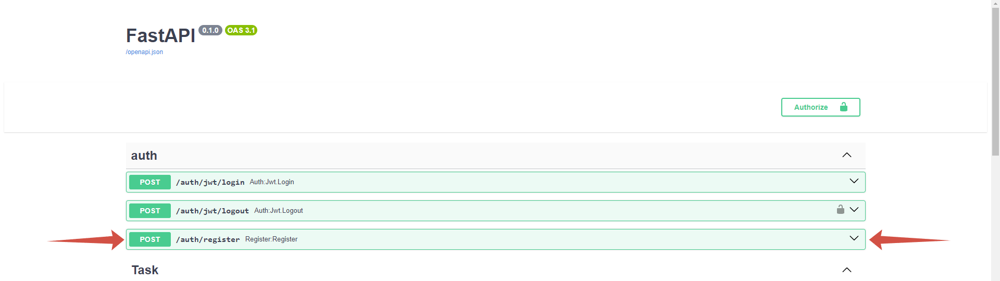
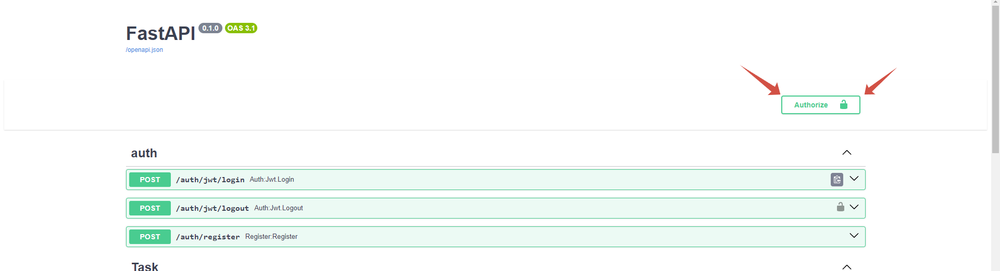

# ***Трекер задач сотрудников***

___

# Проект работает в Docker-compose network

___

# Запуск проекта
* ### 1. Клонировать репозиторий через терминал 
```
git clone https://github.com/IlyaKovalchukKIS/Tracker_Task.git
```  

* ### 2. Нобходимо переименовать файл [.env.example](.env.example) в ```.env``` и добавить в него свои переменные. Пример:
* * > DB_USER=postgres
* * > DB_PASSWORD=password
* * > DB_HOST=your_host_db
* * > DB_PORT=your_port_machine
* * > DB_ECHO=True
* * > SECRET_KEY_AUTH=YOUR_SECRET_KEY

* ### 3. Скачать и установить [Docker](https://www.docker.com/)
* ### 4. Выполнить комманды
```commandline
docker-compose build
```
```commandline
docker-compose up -d
```

* ### 5. Для просмотра документации перейти по адресу http://127.0.0.1:8000/docs/

# Для получения доступа к эндпоинтам 
## 1. Необходимо пройти регистрации в сервисе:
### 
## 2. Пройти авторизацию:
### 
